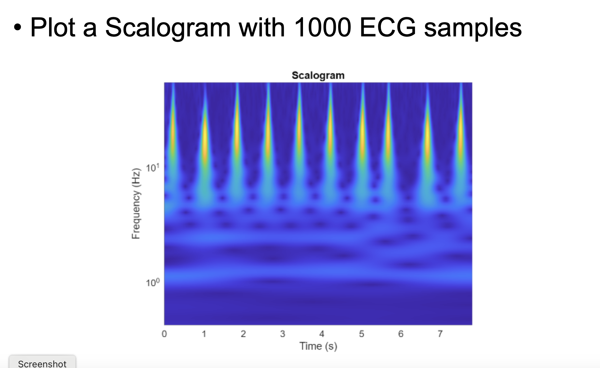

# Electrocardiogram-Time-Series-Classification-Using-2D-CNN

This project demonstrates the classification of electrocardiogram (ECG) time-series data using a 2D Convolutional Neural Network (CNN). Follow the steps below to set up and run the code.

## Step 1: Install MATLAB

1. Go to the website mentioned in the file below:

   - [Link-MATLAB.txt](Link-MATLAB.txt)

2. Use your Huskers or UNO email ID to get a free license.

3. During installation, make sure to mark **Digital Signal Processing** and **Deep Learning Toolbox**. If you missed this step, you can add the toolboxes later through MATLAB's Add-On Explorer.

## Step 2: Download the ECG Dataset

1. Download the ECG dataset from the link below:

   - [Link-PhysioATM.txt](Link-PhysioATM.txt)

2. Select the **MIT BIH Arrhythmia Database** from the website.

3. Choose the **V5** signals and export the signal as a `.mat` file.

## Step 3: Plot an ECG Waveform in MATLAB

1. After downloading the dataset, you can visualize the ECG waveform in MATLAB using the following script:

   - **[ECG_Plot.m](ECG_Plot%20(1).m)**

2. Run the script to generate the ECG waveform.

3. Submit the obtained waveform as a PDF, screenshot, or image file.

## Part 2: Preprocessing and Wavelet Analysis

In this part, we will perform pre-processing on the ECG dataset to prepare it for CNN training. This task will be conducted together during the lecture class on **October 31st**.

1. **Classify Time Series Using Wavelet Analysis and Deep Learning**

   - **[Classify Time Series Using Wavelet Analysis and Deep Learning.pptx](./Classify%20Time%20Series%20Using%20Wavelet%20Analysis%20and%20Deep%20Learning.pptx)**

2. After completing the wavelet analysis, **submit a Word file** that includes all your MATLAB codes and the scalogram figure with **1000 samples**.

3. Do not delete any codes or files from your computer, as we will continue with the CNN training in the next lecture.

## Part 3: CNN Training and Evaluation

In this part, we will perform CNN training and evaluate the results. This task will be conducted together during the lecture class on **November 5th**.

1. **Lecture: CNN Training and Evaluation**

   - **[Lecture_3_AI Project (Continue).pptx](./Lecture_3_AI%20Project%20(Continue).pptx)**

2. After completing the CNN training and evaluation, **submit a Word or PDF file** that includes all your MATLAB codes and screenshots of the answers/figures specified in the slides.

## Lecture Resources

- **[Lecture -1 - Copy.pptx](./Lecture%20-1%20-%20Copy%20(1).pptx)**

## External Resources

For a deeper understanding of Convolutional Neural Networks (CNNs), refer to the following external resources:

- [Introduction to CNN](https://www.geeksforgeeks.org/introduction-convolution-neural-network/)
- [MIT Course Notes on CNNs](https://openlearninglibrary.mit.edu/assets/courseware/v1/41c7c4a6141b76b324055d56387570c0/asset-v1:MITx+6.036+1T2019+type@asset+block/notes_chapter_Convolutional_Neural_Networks.pdf)

---

Feel free to reach out for any queries or assistance regarding the project.

## Image Display

  

